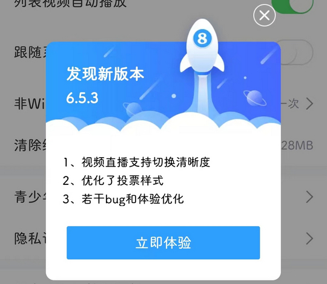
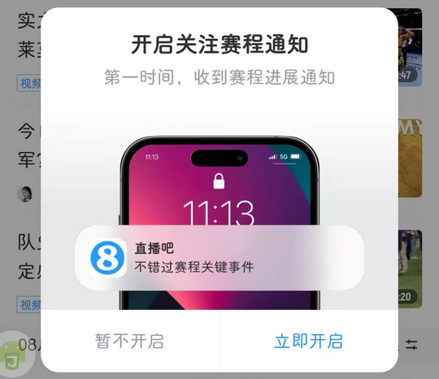

# android.zhibo8（直播吧）

## 基础规则

快速复制:
```
{"popup_rules":
    [
        {"id":"发现新版本","action":"iv_cancel"},
        {"id":"开启&通知","action":"暂不开启"},
        {"id":"签到成功","action":"iv_close"}
    ]
}
```
详细说明：
- [{"id":"发现新版本","action":"iv_cancel"}](#id发现新版本actioniv_cancel)
- [{"id":"开启&通知","action":"暂不开启"}](#id开启通知action暂不开启)
- [{"id":"签到成功","action":"iv_close"}](#id签到成功actioniv_close)

### {"id":"发现新版本","action":"iv_cancel"}
关闭更新弹窗



### {"id":"开启&通知","action":"暂不开启"}
关闭开启通知弹窗



### {"id":"签到成功","action":"iv_close"}
关闭签到成功弹窗


## 增强规则
