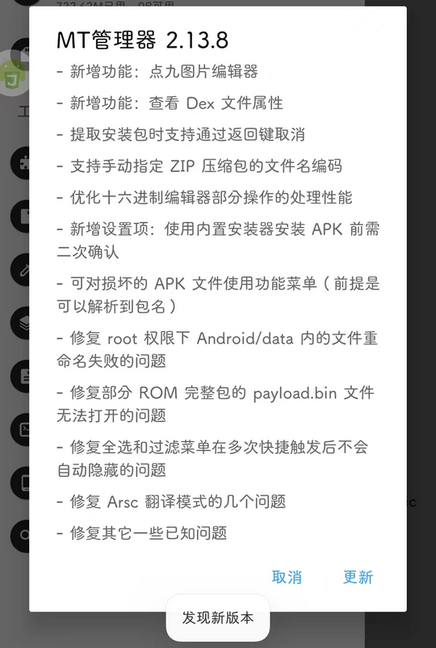

# bin.mt.plus（MT管理器）

## 普通规则

快速复制:
```
{"popup_rules":
    [
        {"id":"=更新","action":"=取消"}
    ]
}
```
详细说明：
- [{"id":"=更新","action":"=取消"}](#id更新action取消)

### {"id":"=更新","action":"=取消"}
关闭更新弹窗




## 增强规则
