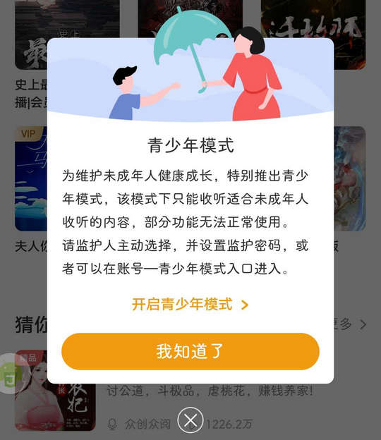
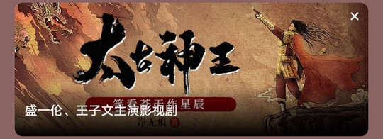

# bubei.tingshu（懒人听书）

## 基础规则

快速复制:
```
{"popup_rules":
    [
        {"id":"青少年模式","action":"我知道了"},
        {"id":"fl_newcomer_gift","action":"iv_close"},
        {"id":"banner_icon_iv","action":"colse_iv"},
        {"id":"tv_usercenter_notify_title","action":"iv_usercenter_notify_close"},
        {"id":"VIP限时超低价","action":"icon_close_popup"},
        {"id":"ad_name_tv","action":"ad_close_iv"},
        {"id":"free_mode_dialog_image","action":"dialog_close_btn"}
    ]
}
```
详细说明：
- [{"id":"青少年模式","action":"我知道了"}](#id青少年模式action我知道了)
- [{"id":"fl_newcomer_gift","action":"iv_close"}](#idfl_newcomer_giftactioniv_close)
- [{"id":"banner_icon_iv","action":"colse_iv"}](#idbanner_icon_ivactioncolse_iv)
- [{"id":"tv_usercenter_notify_title","action":"iv_usercenter_notify_close"}](#idtv_usercenter_notify_titleactioniv_usercenter_notify_close)
- [{"id":"VIP限时超低价","action":"icon_close_popup"}](#idvip限时超低价actionicon_close_popup)
- [{"id":"ad_name_tv","action":"ad_close_iv"}](#idad_name_tvactionad_close_iv)
- [{"id":"free_mode_dialog_image","action":"dialog_close_btn"}](#idfree_mode_dialog_imageactiondialog_close_btn)

### {"id":"青少年模式","action":"我知道了"}
关闭青少年模式弹窗



### {"id":"fl_newcomer_gift","action":"iv_close"}
关闭新用户礼包弹窗


### {"id":"banner_icon_iv","action":"colse_iv"}
关闭运营广告


### {"id":"tv_usercenter_notify_title","action":"iv_usercenter_notify_close"}
关闭打开系统通知提示信息


### {"id":"VIP限时超低价","action":"icon_close_popup"}
关闭VIP限时超低价弹窗


### {"id":"ad_name_tv","action":"ad_close_iv"}
关闭播放页面广告信息



### {"id":"free_mode_dialog_image","action":"dialog_close_btn"}
关闭看广告免费畅听弹窗


## 增强规则
