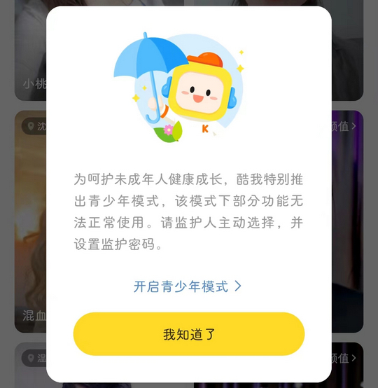
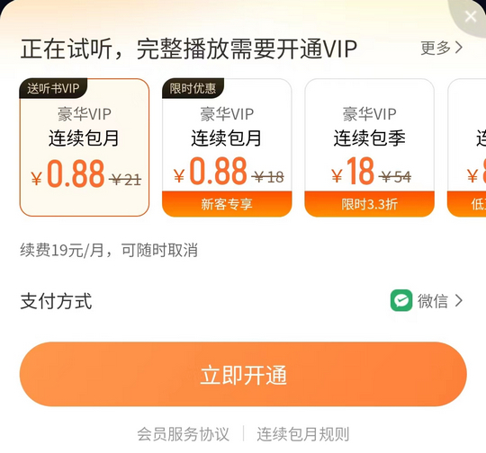

# cn.kuwo.player（酷我音乐）

## 普通规则

快速复制:
```
{"popup_rules":
    [
        {"id":"青少年模式","action":"我知道了"},
        {"id":"正在试听，完整播放需要开通VIP","action":"GLOBAL_ACTION_BACK"}
    ]
}
```
详细说明：
- [{"id":"青少年模式","action":"我知道了"}](#id青少年模式action我知道了)
- [{"id":"正在试听，完整播放需要开通VIP","action":"GLOBAL_ACTION_BACK"}](#id正在试听完整播放需要开通vipactionglobal_action_back)

### {"id":"青少年模式","action":"我知道了"}
关闭青少你模式弹窗



### {"id":"正在试听，完整播放需要开通VIP","action":"GLOBAL_ACTION_BACK"}
关闭音乐试听状态下开通VIP弹窗



## 增强规则
