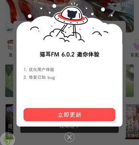
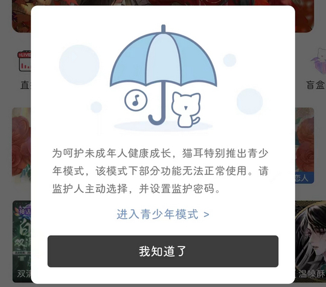

# cn.missevan（猫耳FM）

## 普通规则

快速复制:
```
{"popup_rules":
    [
        {"id":"umeng_update_id_ok","action":"umeng_update_id_cancel"},
        {"id":"青少年模式","action":"我知道了"}
    ]
}
```
详细说明：
- [{"id":"umeng_update_id_ok","action":"umeng_update_id_cancel"}](#idumeng_update_id_okactionumeng_update_id_cancel)
- [{"id":"青少年模式","action":"我知道了"}](#id青少年模式action我知道了)

### {"id":"umeng_update_id_ok","action":"umeng_update_id_cancel"}
关闭更新弹窗



### {"id":"青少年模式","action":"我知道了"}
关闭青少年模式弹窗



## 增强规则
