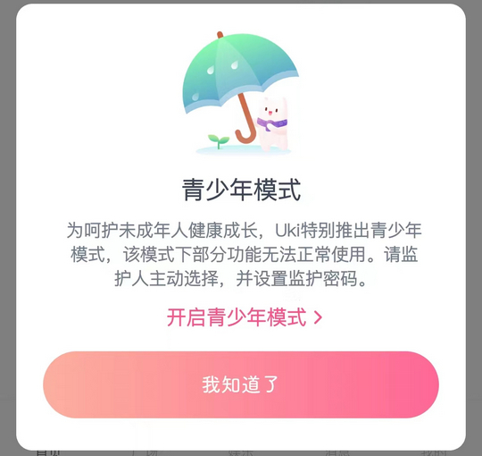
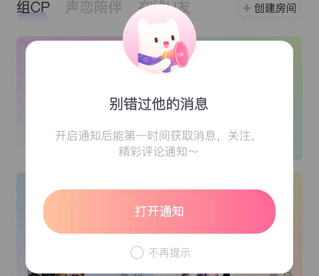
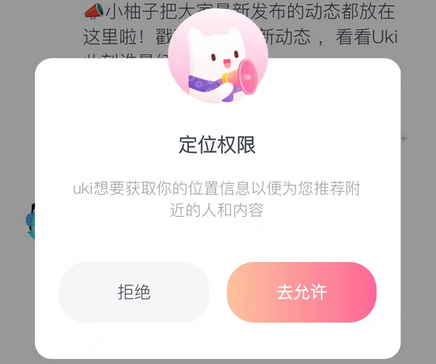
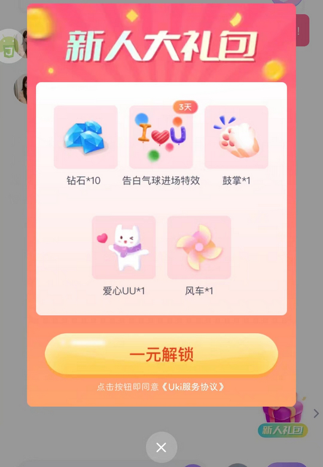
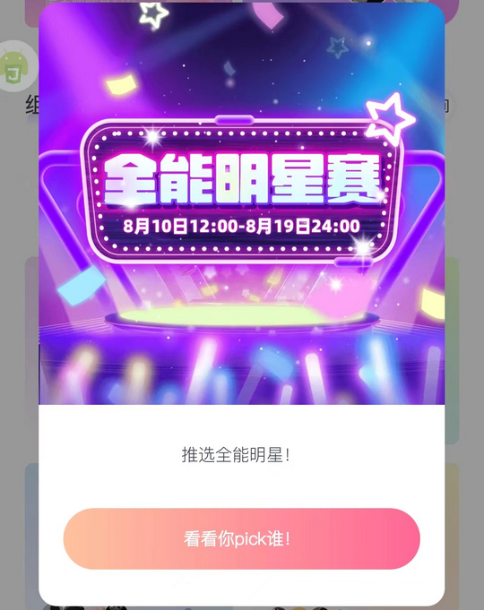

# cn.neoclub.uki（Uki）

## 普通规则

快速复制:
```
{"popup_rules":
    [
        {"id":"青少年模式","action":"我知道了"},
        {"id":"开启通知","action":"不再提示"},
        {"id":"tv_text_match","action":"iv_heart_match_x"},
        {"id":"定位权限","action":"拒绝"},
        {"id":"iv_gift_info","action":"iv_close"},
        {"id":"action_bar_root","action":"GLOBAL_ACTION_BACK"}
    ]
}
```
详细说明：
- [{"id":"青少年模式","action":"我知道了"}](#id青少年模式action我知道了)
- [{"id":"开启通知","action":"不再提示"}](#id开启通知action不再提示)
- [{"id":"tv_text_match","action":"iv_heart_match_x"}](#idtv_text_matchactioniv_heart_match_x)
- [{"id":"定位权限","action":"拒绝"}](#id定位权限action拒绝)
- [{"id":"iv_gift_info","action":"iv_close"}](#idiv_gift_infoactioniv_close)
- [{"id":"action_bar_root","action":"GLOBAL_ACTION_BACK"}](#idaction_bar_rootactionglobal_action_back)

### {"id":"青少年模式","action":"我知道了"}
去除青少年模式弹窗



### {"id":"开启通知","action":"不再提示"}
去除开启通知弹窗



### {"id":"tv_text_match","action":"iv_heart_match_x"}
去除组CP弹窗


### {"id":"定位权限","action":"拒绝"}
去除定位权限弹窗



### {"id":"iv_gift_info","action":"iv_close"}
去除新人大礼包弹窗



### {"id":"action_bar_root","action":"GLOBAL_ACTION_BACK"}
去除活动弹窗




## 增强规则
