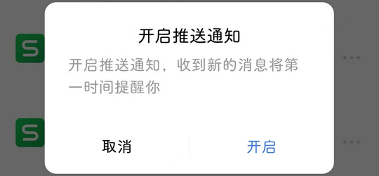

# cn.wps.yun（金山文档）

## 普通规则

快速复制:
```
{"popup_rules":
    [
        {"id":"发现新版本","action":"cancel"},
        {"id":"开启推送通知","action":"取消"}
    ]
}
```
详细说明：
- [{"id":"发现新版本","action":"cancel"}](#id发现新版本actioncancel)
- [{"id":"开启推送通知","action":"取消"}](#id开启推送通知action取消)

### {"id":"发现新版本","action":"cancel"}
去除更新弹窗提示


### {"id":"开启推送通知","action":"取消"}
去除开启推送通知弹窗



## 增强规则
