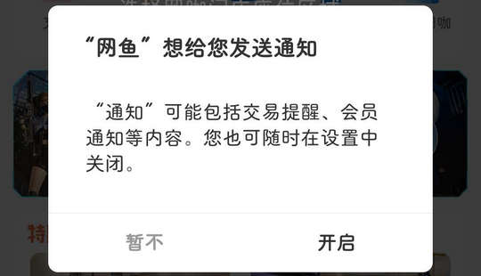

# cn.wywk.app（网鱼）

## 基础规则

快速复制:
```
{"popup_rules":
    [
        {"id":"想给您发送通知","action":"暂不"}
    ]
}
```
详细说明：
- [{"id":"想给您发送通知","action":"暂不"}](#id想给您发送通知action暂不)

### {"id":"想给您发送通知","action":"暂不"}
关闭打开通知弹窗




## 增强规则
