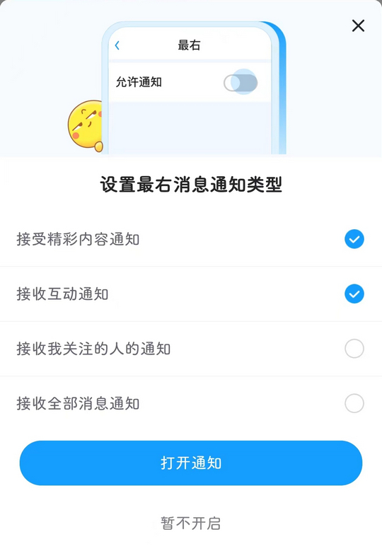

# cn.xiaochuankeji.tieba（最右）

## 普通规则

快速复制:
```
{"popup_rules":
    [
        {"id":"设置最右消息通知类型","action":"暂不开启"},
        {"id":"lottie_view","action":"iv_delete"},
        {"id":"+开启通知","action":"tips_close"},
        {"id":"账号绑定手机号可以提升安全性","action":"btn_close"}
    ]
}
```
详细说明：
- [{"id":"设置最右消息通知类型","action":"暂不开启"}](#id设置最右消息通知类型action暂不开启)
- [{"id":"lottie_view","action":"iv_delete"}](#idlottie_viewactioniv_delete)
- [{"id":"+开启通知","action":"tips_close"}](#id开启通知actiontips_close)
- [{"id":"账号绑定手机号可以提升安全性","action":"btn_close"}](#id账号绑定手机号可以提升安全性actionbtn_close)

### {"id":"设置最右消息通知类型","action":"暂不开启"}
去除开启通知弹窗



### {"id":"lottie_view","action":"iv_delete"}
去除侧边悬浮广告


### {"id":"+开启通知","action":"tips_close"}
去除 “消息” 页面开启通知提示信息


### {"id":"账号绑定手机号可以提升安全性","action":"btn_close"}
去除 “我的” 页面下方绑定手机号提示信息


## 增强规则
