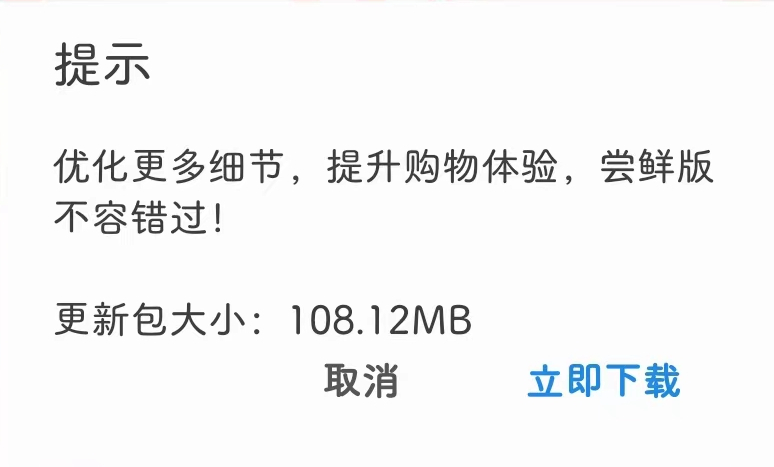

# com.alibaba.wireless（阿里巴巴）

## 普通规则

快速复制:
```
{"popup_rules":
    [
        {"id":"update_title","action":"update_button_cancel"}
    ]
}
```
详细说明：
- [{"id":"update_title","action":"update_button_cancel"}](#idupdate_titleactionupdate_button_cancel)

### {"id":"update_title","action":"update_button_cancel"}
关闭更新弹窗（⚠ 似乎不起作用） 



## 增强规则
