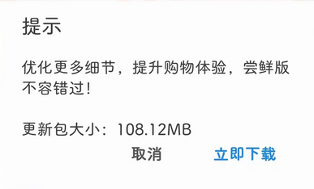

# com.alibaba.wireless（阿里巴巴）

## 普通规则

快速复制:
```
{"popup_rules":
    [
        {"id":"update_title","action":"取消"}
    ]
}
```
详细说明：
- [{"id":"update_title","action":"取消"}](#idupdate_titleaction取消)

### {"id":"update_title","action":"取消"}
去除更新提示。



## 增强规则
