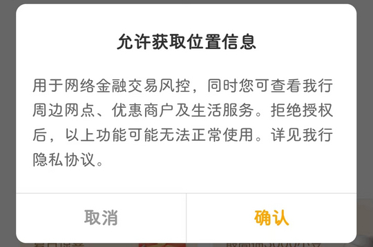
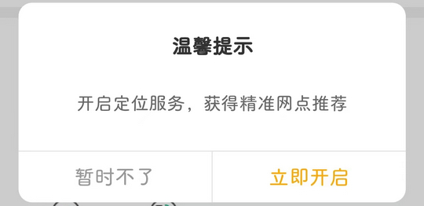

# com.android.bankabc（中国农业银行）

## 普通规则

快速复制:
```
{"popup_rules":
    [
        {"id":"iv_ad","action":"close"},
        {"id":"邀您体验新版本","action":"残忍拒绝"},
        {"id":"允许获取位置信息","action":"取消"},
        {"id":"iv_notification_reminder_dialog","action":"iv_notification_reminder_dialog_close"},
        {"id":"iv_switch","action":"iv_skip"},
        {"id":"开启定位服务","action":"暂时不了"}
    ]
}
```
详细说明：
- [{"id":"iv_ad","action":"close"}](#idiv_adactionclose)
- [{"id":"邀您体验新版本","action":"残忍拒绝"}](#id邀您体验新版本action残忍拒绝)
- [{"id":"允许获取位置信息","action":"取消"}](#id允许获取位置信息action取消)
- [{"id":"iv_notification_reminder_dialog","action":"iv_notification_reminder_dialog_close"}](#idiv_notification_reminder_dialogactioniv_notification_reminder_dialog_close)
- [{"id":"iv_switch","action":"iv_skip"}](#idiv_switchactioniv_skip)
- [{"id":"开启定位服务","action":"暂时不了"}](#id开启定位服务action暂时不了)

### {"id":"iv_ad","action":"close"}
去除开屏广告


### {"id":"邀您体验新版本","action":"残忍拒绝"}
去除更新弹窗


### {"id":"允许获取位置信息","action":"取消"}
去除获取位置信息弹窗



### {"id":"iv_notification_reminder_dialog","action":"iv_notification_reminder_dialog_close"}
去除开启消息通知弹窗


### {"id":"iv_switch","action":"iv_skip"}
去除切换乡村版弹窗


### {"id":"开启定位服务","action":"暂时不了"}
去除开启定位服务弹窗




## 增强规则
