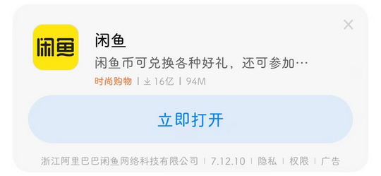

# com.android.thememanager（MIUI 主题壁纸）

## 基础规则

快速复制:
```
{"popup_rules":
    [
        {"id":"ad_title","action":"ad_close_btn"}
    ]
}
```
详细说明：
- [{"id":"ad_title","action":"ad_close_btn"}](#idad_titleactionad_close_btn)

### {"id":"ad_title","action":"ad_close_btn"}
关闭主题详情页面下方广告

✔ 此规则需联合 [MIUI 智能服务](../../com.M/com.miui.systemAdSolution/readme.md#id为什么不希望看到这条推广action不感兴趣) 规则生效




## 增强规则
