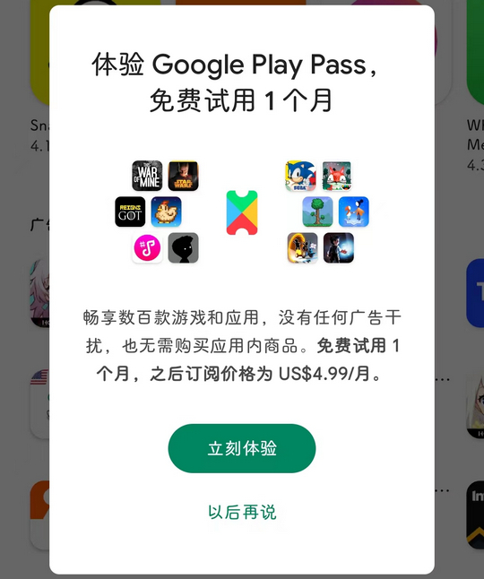

# com.android.vending（Play商店）

## 基础规则

快速复制:
```
{"popup_rules":
    [
        {"id":"体验 Google Play Pass，免费试用 1 个月","action":"以后再说"}
    ]
}
```
详细说明：
- [{"id":"体验 Google Play Pass，免费试用 1 个月","action":"以后再说"}](#id体验-google-play-pass免费试用-1-个月action以后再说)

### {"id":"体验 Google Play Pass，免费试用 1 个月","action":"以后再说"}
关闭试用 Google Play Pass 弹窗




## 增强规则
