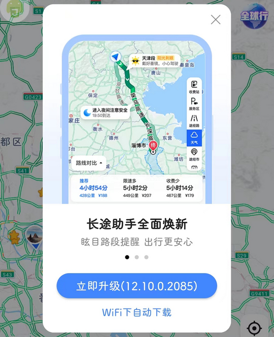
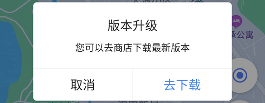

# com.autonavo.minimap（高德地图）

## 基础规则

快速复制:
```
{"popup_rules":
    [
        {"id":"立即升级","action":"iv_close"},
        {"id":"版本升级","action":"取消"},
        {"id":"msgbox_popup_clear","action":"msgbox_popup_clear"}
    ]
}
```

详细说明：
- [{"id":"立即升级","action":"iv_close"}](#id立即升级actioniv_close)
- [{"id":"版本升级","action":"取消"}](#id版本升级action取消)
- [{"id":"msgbox_popup_clear","action":"msgbox_popup_clear"}](#idmsgbox_popup_clearactionmsgbox_popup_clear)

### {"id":"立即升级","action":"iv_close"}
关闭更新弹窗-1



### {"id":"版本升级","action":"取消"}
关闭更新弹窗-2



### {"id":"msgbox_popup_clear","action":"msgbox_popup_clear"}
关闭首页上方横幅广告


## 增强规则