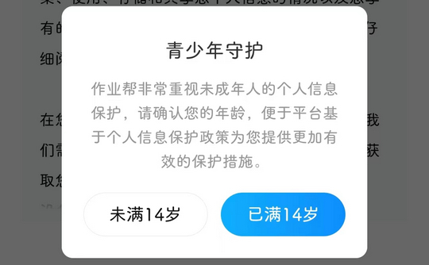

# com.baidu.homework（作业帮）

## 基础规则

快速复制:
```
{"popup_rules":
    [
        {"id":"青少年守护","action":"已满14岁"},
        {"id":"开启消息推送通知","action":"close_img"}
    ]
}
```
详细说明：
- [{"id":"青少年守护","action":"已满14岁"}](#id青少年守护action已满14岁)
- [{"id":"开启消息推送通知","action":"close_img"}](#id开启消息推送通知actionclose_img)

### {"id":"青少年守护","action":"已满14岁"}
去除青少年模式弹窗



### {"id":"开启消息推送通知","action":"close_img"}
去除首页 “开启消息推送通知” 弹窗


## 增强规则
