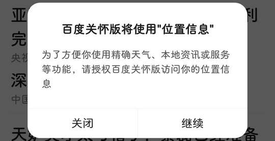

# com.baidu.searchbox.senior（百度关怀版）

## 基础规则

快速复制:
```
{"popup_rules":
    [
        {"id":"授权&位置信息","action":"关闭"}
    ]
}
```
详细说明：
- [{"id":"授权&位置信息","action":"关闭"}](#id授权位置信息action关闭)

### {"id":"授权&位置信息","action":"关闭"}
关闭授权位置信息弹窗




## 增强规则
