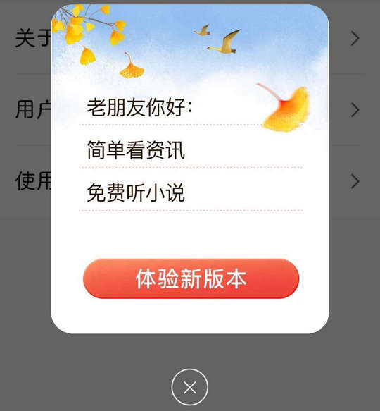

# com.baidu.searchbox.tomas（百度大字版）

⚠ 该 App 界面控件 ID 经过混淆，对其适配极其有限。

## 基础规则

快速复制:
```
{"popup_rules":
    [
        {"id":"立即升级","action":"关闭"}
    ]
}
```
详细说明：
- [{"id":"立即升级","action":"关闭"}](#id立即升级action关闭)

### {"id":"立即升级","action":"关闭"}
关闭更新弹窗




## 增强规则
