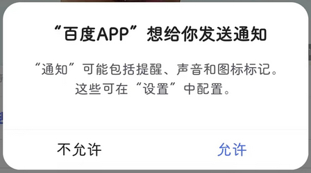

# com.baidu.searchbox（百度）

## 基础规则

快速复制:
```
{"popup_rules":
    [
        {"id":"想给你发送通知","action":"不允许"}
    ]
}
```
详细说明：
- [{"id":"想给你发送通知","action":"不允许"}](#id想给你发送通知action不允许)

### {"id":"想给你发送通知","action":"不允许"}
去除 “百度APP想给你发送通知” 弹窗



## 增强规则
