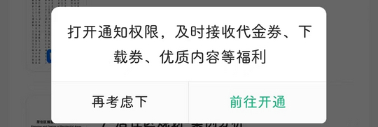

# com.baidu.wenku（百度文库）

## 普通规则

快速复制:
```
{"popup_rules":
    [
        {"id":"新人签到礼","action":"close_btn"},
        {"id":"打开通知权限","action":"再考虑下"},
        {"id":"百度文库&评分","action":"score_close"},
        {"id":"开启消息通知","action":"close_btn"},
        {"id":"limit-red-packet-img-title","action":"GLOBAL_ACTION_BACK"},
        {"id":"read_gif_iv","action":"GLOBAL_ACTION_BACK"},
        {"id":"act_style_content_bg_iv","action":"act_style_iv_close"}
    ]
}
```
详细说明：
- [{"id":"新人签到礼","action":"close_btn"}](#id新人签到礼actionclose_btn)
- [{"id":"打开通知权限","action":"再考虑下"}](#id打开通知权限action再考虑下)
- [{"id":"百度文库&评分","action":"score_close"}](#id百度文库评分actionscore_close)
- [{"id":"开启消息通知","action":"close_btn"}](#id开启消息通知actionclose_btn)
- [{"id":"limit-red-packet-img-title","action":"GLOBAL_ACTION_BACK"}](#idlimit-red-packet-img-titleactionglobal_action_back)
- [{"id":"read_gif_iv","action":"GLOBAL_ACTION_BACK"}](#idread_gif_ivactionglobal_action_back)
- [{"id":"act_style_content_bg_iv","action":"act_style_iv_close"}](#idact_style_content_bg_ivactionact_style_iv_close)

### {"id":"新人签到礼","action":"close_btn"}
关闭新人签到礼弹窗


### {"id":"打开通知权限","action":"再考虑下"}
关闭打开通知权限弹窗



### {"id":"百度文库&评分","action":"score_close"}
关闭百度文库评分弹窗


### {"id":"开启消息通知","action":"close_btn"}
关闭签到成功后开启消息通知弹窗


### {"id":"limit-red-packet-img-title","action":"GLOBAL_ACTION_BACK"}
关闭限时会员福利弹窗


### {"id":"read_gif_iv","action":"GLOBAL_ACTION_BACK"}
关闭文档页面神秘礼物弹窗


### {"id":"act_style_content_bg_iv","action":"act_style_iv_close"}
关闭会员优惠券弹窗


## 增强规则
