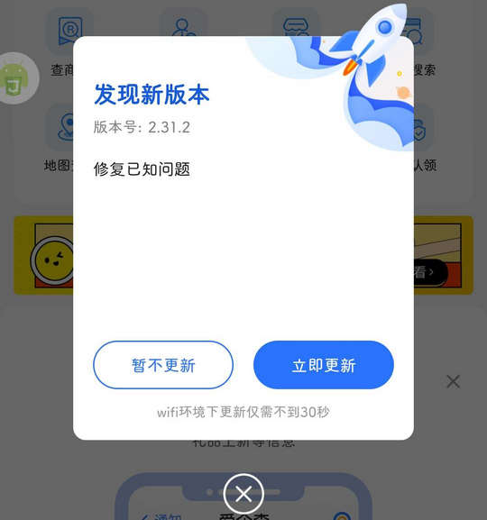

# com.baidu.xin.aiqicha（爱企查）

## 基础规则

快速复制:
```
{"popup_rules":
    [
        {"id":"发现新版本","action":"暂不更新"},
        {"id":"开启消息通知","action":"notice_dialog_cancel_iv"},
        {"id":"打开消息通知","action":"close"},
        {"id":"订阅微信通知","action":"cancel_iv"},
        {"id":"写好评，鼓励一下","action":"不了，谢谢"}
    ]
}
```
详细说明：
- [{"id":"发现新版本","action":"暂不更新"}](#id发现新版本action暂不更新)
- [{"id":"开启消息通知","action":"notice_dialog_cancel_iv"}](#id开启消息通知actionnotice_dialog_cancel_iv)
- [{"id":"打开消息通知","action":"close"}](#id打开消息通知actionclose)
- [{"id":"订阅微信通知","action":"cancel_iv"}](#id订阅微信通知actioncancel_iv)
- [{"id":"写好评，鼓励一下","action":"不了，谢谢"}](#id写好评鼓励一下action不了谢谢)

### {"id":"发现新版本","action":"暂不更新"}
关闭更新弹窗



### {"id":"开启消息通知","action":"notice_dialog_cancel_iv"}
关闭开启消息通知弹窗


### {"id":"打开消息通知","action":"close"}
关闭打开消息通知提示信息


### {"id":"订阅微信通知","action":"cancel_iv"}
关闭订阅微信通知提示信息


### {"id":"写好评，鼓励一下","action":"不了，谢谢"}
关闭好评鼓励弹窗


## 增强规则
