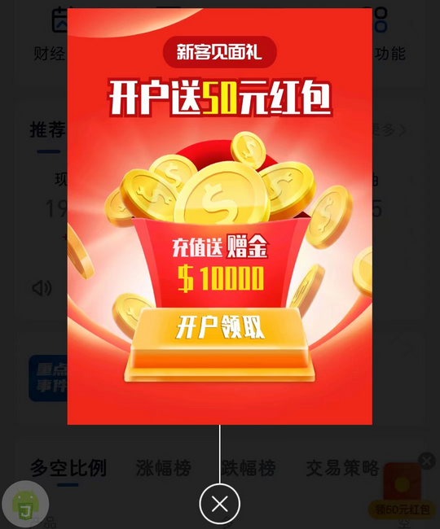

# com.btzx0313.app（必拓资讯）

## 普通规则

快速复制:
```
{"popup_rules":
    [
        {"id":"ads_imageview","action":"btn_cancel"},
        {"id":"rlEnvelope","action":"ivCancel"}
    ]
}
```
详细说明：
- [{"id":"ads_imageview","action":"btn_cancel"}](#idads_imageviewactionbtn_cancel)
- [{"id":"rlEnvelope","action":"ivCancel"}](#idrlenvelopeactionivcancel)

### {"id":"ads_imageview","action":"btn_cancel"}
去除 “新用户见面礼” 弹窗



### {"id":"rlEnvelope","action":"ivCancel"}
去除首页右侧悬浮红包


## 增强规则
