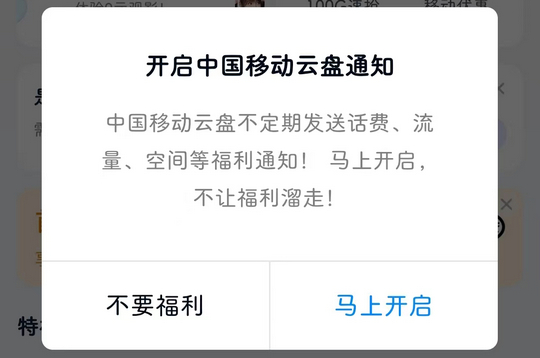

# com.chinamobile.mcloud（中国移动云盘）

## 基础规则

快速复制:
```
{"popup_rules":
    [
        {"id":"开启&通知","action":"不要福利"},
        {"id":"view_pager","action":"iv_close"},
        {"id":"iv_logo","action":"iv_close"},
        {"id":"viewpager","action":"iv_home_delete"}
    ]
}
```
详细说明：
- [{"id":"开启&通知","action":"不要福利"}](#id开启通知action不要福利)
- [{"id":"view_pager","action":"iv_close"}](#idview_pageractioniv_close)
- [{"id":"iv_logo","action":"iv_close"}](#idiv_logoactioniv_close)
- [{"id":"viewpager","action":"iv_home_delete"}](#idviewpageractioniv_home_delete)

### {"id":"开启&通知","action":"不要福利"}
关闭 “发现” 页面弹窗广告



### {"id":"view_pager","action":"iv_close"}
关闭首页弹窗广告


### {"id":"iv_logo","action":"iv_close"}
关闭 “我的” 页面右下角悬浮广告


### {"id":"viewpager","action":"iv_home_delete"}
关闭首页中间广告


## 增强规则
