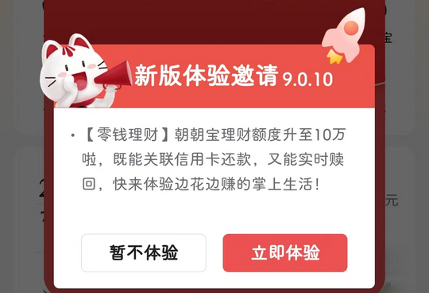
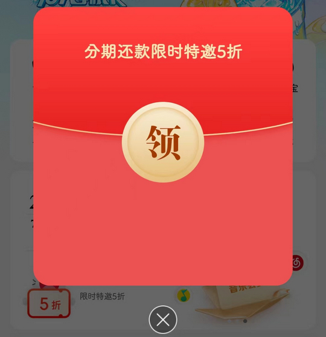

# com.cmbchina.ccd.pluto.cmbActivity（掌上生活）

## 普通规则

快速复制:
```
{"popup_rules":
    [
        {"id":"新版体验邀请","action":"bt_cancel_experience"},
        {"id":"tv_red_envelop_main_title","action":"img_cf_view_close"},
        {"id":"img_floating_ad_cmb","action":"img_close_floating_ad_cmb"}
    ]
}
```
详细说明：
- [{"id":"新版体验邀请","action":"bt_cancel_experience"}](#id新版体验邀请actionbt_cancel_experience)
- [{"id":"tv_red_envelop_main_title","action":"img_cf_view_close"}](#idtv_red_envelop_main_titleactionimg_cf_view_close)
- [{"id":"img_floating_ad_cmb","action":"img_close_floating_ad_cmb"}](#idimg_floating_ad_cmbactionimg_close_floating_ad_cmb)

### {"id":"新版体验邀请","action":"bt_cancel_experience"}
去除 “新版本体验” 弹窗



### {"id":"tv_red_envelop_main_title","action":"img_cf_view_close"}
去除首页 “分期还款限时特惠” 弹窗



### {"id":"img_floating_ad_cmb","action":"img_close_floating_ad_cmb"}
去除 “我的” 页面侧边悬浮广告


## 增强规则