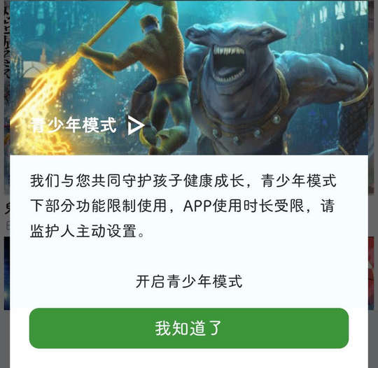

# com.comic.cartoon36（36漫画）

⚠ 该 App 使用了 优量汇 SDK 向用户提供广告弹窗，部分广告无法通过规则关闭。

## 基础规则

快速复制:
```
{"popup_rules":
    [
        {"id":"删除所有广告","action":"跳过"},
        {"id":"青少年模式","action":"我知道了"}
    ],
    "click_way_popup":1
}
```
详细说明：
- [{"id":"删除所有广告","action":"跳过"}](#id删除所有广告action跳过)
- [{"id":"青少年模式","action":"我知道了"}](#id青少年模式action我知道了)

### {"id":"删除所有广告","action":"跳过"}
关闭开屏广告

⚠ 需配合参数 "click_way_popup":1 生效


### {"id":"青少年模式","action":"我知道了"}
关闭青少年模式弹窗




## 增强规则
