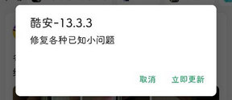

# com.coolapk.market（酷安）

## 基础规则

快速复制:
```
{"popup_rules":
    [
        {"id":"=立即更新","action":"=取消"},

        {"id":"ad_time_view","action":"=关闭"},
        {"id":"关闭广告","action":"=不感兴趣"},
        {"id":"不感兴趣&举报广告","action":"=不感兴趣"},
        {"id":"coolapk_card_view","action":"close_view"}
    ]
}
```
详细说明：
- [{"id":"=立即更新","action":"=取消"}](#id立即更新action取消)
- [{"id":"ad_time_view","action":"close_view"} - {"id":"coolapk_card_view","action":"close_view"}](#idad_time_viewactionclose_view---idcoolapk_card_viewactionclose_view)

### {"id":"=立即更新","action":"=取消"}
关闭更新弹窗



### {"id":"ad_time_view","action":"close_view"} - {"id":"coolapk_card_view","action":"close_view"}
**联合规则**: 关闭评论区广告

⚡需要手动触发


## 增强规则
