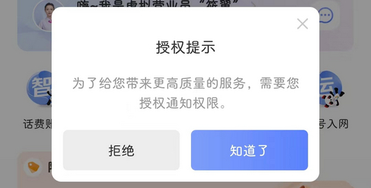
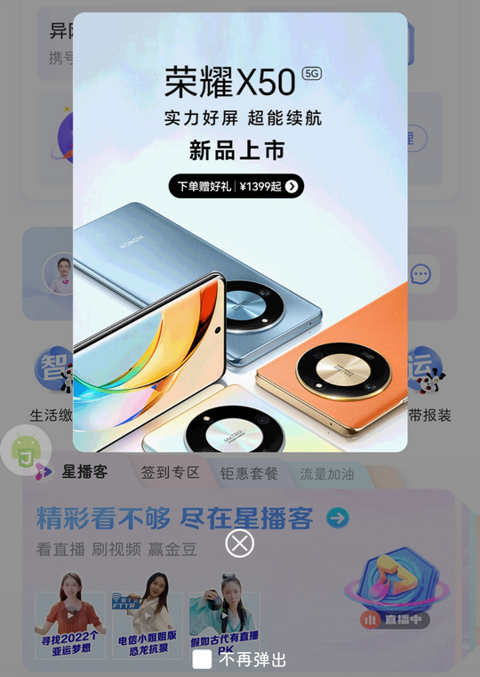

# com.ct.client（中国电信）

## 基础规则

快速复制:
```
{"popup_rules":
    [
        {"id":"授权提示","action":"拒绝"},
        {"id":"=数字人","action":"=关闭"},
        {"id":"my_imageview","action":"close"}
    ]
}
```
详细说明：
- [{"id":"授权提示","action":"拒绝"}](#id授权提示action拒绝)
- [{"id":"=数字人","action":"=关闭"}](#id数字人action关闭)
- [{"id":"my_imageview","action":"close"}](#idmy_imageviewactionclose)

### {"id":"授权提示","action":"拒绝"}
去除授权通知权限弹窗



### {"id":"=数字人","action":"=关闭"}
去除 “查询办理” 页面右侧数字人


### {"id":"my_imageview","action":"close"}
去除首页弹窗广告



## 增强规则
