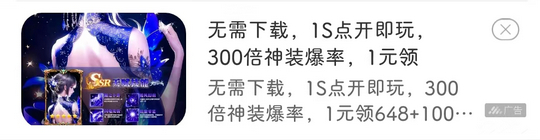

# com.dmzj.manhua（动漫之家）

## 基础规则

快速复制:
```
{"popup_rules":
    [
        {"id":"青少年模式","action":"=我知道了"},
        {"id":"ivFloatAd","action":"ivAdClose"},
        {"id":"layout_ad_layout","action":"native_ad_close"},
        {"id":"ad_flag_source_layout","action":"iv_close"},
        {"id":"native_ad_image","action":"native_ad_close"},
        {"id":"native_ad_title","action":"native_ad_close"}
    ]
}
```
详细说明：
- [{"id":"青少年模式","action":"=我知道了"}](#id青少年模式action我知道了)
- [{"id":"ivFloatAd","action":"ivAdClose"}](#idivfloatadactionivadclose)
- [{"id":"layout_ad_layout","action":"native_ad_close"}](#idlayout_ad_layoutactionnative_ad_close)
- [{"id":"ad_flag_source_layout","action":"iv_close"}](#idad_flag_source_layoutactioniv_close)
- [{"id":"native_ad_image","action":"native_ad_close"}](#idnative_ad_imageactionnative_ad_close)
- [{"id":"native_ad_title","action":"native_ad_close"}](#idnative_ad_titleactionnative_ad_close)

### {"id":"青少年模式","action":"=我知道了"}
去除 “青少年模式” 弹窗


### {"id":"ivFloatAd","action":"ivAdClose"}
去除右下角悬浮广告


### {"id":"layout_ad_layout","action":"native_ad_close"}
去除作品详情页广告（⚡ 可能需要手动触发）


### {"id":"ad_flag_source_layout","action":"iv_close"}
去除首页广告弹窗


### {"id":"native_ad_image","action":"native_ad_close"}
去除 “新闻” 页面广告



### {"id":"native_ad_title","action":"native_ad_close"}
去除 “漫画” 页面嵌入的广告


## 增强规则
