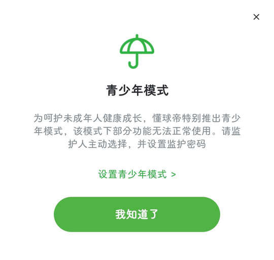
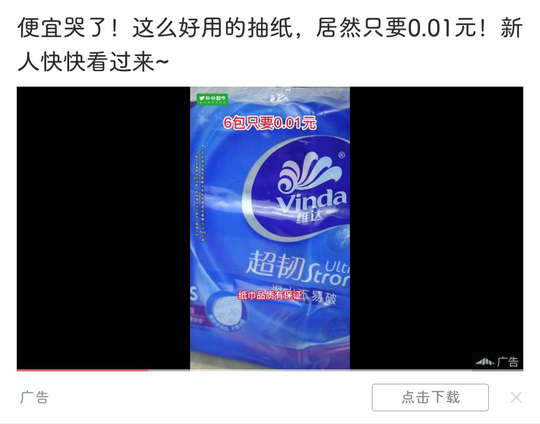

# com.dongqiudi.news（懂球帝）

⚠ 该 App 使用了 优量汇 SDK 向用户提供广告弹窗，部分广告无法通过规则关闭。

## 基础规则

快速复制:
```
{"popup_rules":
    [
        {"id":"青少年模式","action":"我知道了"},

        {"id":"ads_image","action":"feedback_close"},
        {"id":"选择理由，优化你的广告","action":"诱导点击"},

        {"id":"ads_label","action":"feedback_close"}
    ]
}
```
详细说明：
- [{"id":"青少年模式","action":"我知道了"}](#id青少年模式action我知道了)
- [{"id":"ads_image","action":"feedback_close"} - {"id":"选择理由，优化你的广告","action":"诱导点击"}](#idads_imageactionfeedback_close---id选择理由优化你的广告action诱导点击)
- [{"id":"ads_label","action":"feedback_close"}](#idads_labelactionfeedback_close)

### {"id":"青少年模式","action":"我知道了"}
关闭青少年模式弹窗



### {"id":"ads_image","action":"feedback_close"} - {"id":"选择理由，优化你的广告","action":"诱导点击"}
**联合规则**：关闭信息流商城广告

⚡ 需要手动触发


### {"id":"ads_label","action":"feedback_close"}
**联合规则**：关闭信息流广告

⚡ 需要手动触发



## 增强规则
