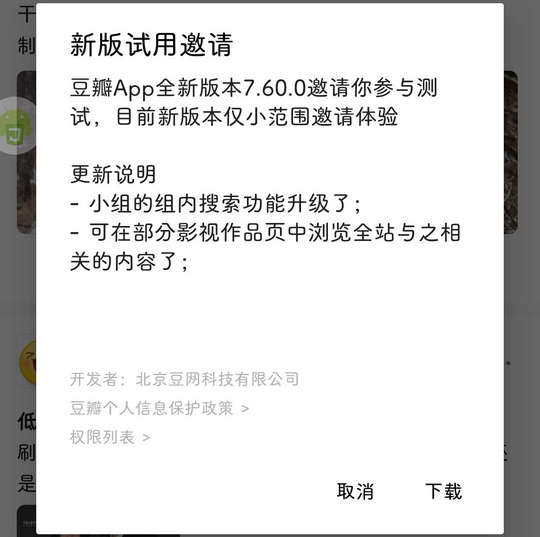

# com.douban.frodo（豆瓣）

## 基础规则

快速复制:
```
{"popup_rules":
    [
        {"id":"新版试用","action":"取消"},

        {"id":"ad_download","action":"ad_not_interest"},
        {"id":"不感兴趣&投诉","action":"不感兴趣"},

        {"id":"push_tip_title","action":"close_tip"},

        {"id":"ad_header_new","action":"menu_item"}
    ]
}
```
详细说明：
- [{"id":"新版试用","action":"取消"}](#id新版试用action取消)
- [{"id":"ad_download","action":"ad_not_interest"} - {"id":"不感兴趣&投诉","action":"不感兴趣"}](#idad_downloadactionad_not_interest---id不感兴趣投诉action不感兴趣)
- [{"id":"push_tip_title","action":"close_tip"}](#idpush_tip_titleactionclose_tip)
- [{"id":"ad_header_new","action":"menu_item"}](#idad_header_newactionmenu_item)

### {"id":"新版试用","action":"取消"}
关闭更新弹窗



### {"id":"ad_download","action":"ad_not_interest"} - {"id":"不感兴趣&投诉","action":"不感兴趣"}
**联合规则**：关闭影视评论区广告（部分）


### {"id":"push_tip_title","action":"close_tip"}
关闭开启推送提示信息


### {"id":"ad_header_new","action":"menu_item"}
关闭精选页面信息流广告

⚠ 此规则依赖于 `{"id":"不感兴趣&投诉","action":"不感兴趣"}`

⚡ 可能需要手动触发


## 增强规则
