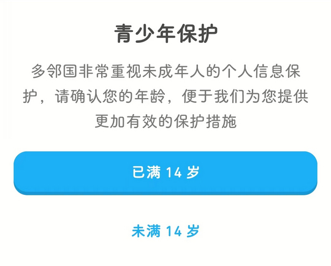

# com.duolingo（多邻国）

## 普通规则

快速复制:
```
{"popup_rules":
    [
        {"id":"青少年保护","action":"okButton"},
        {"id":"关注&公众号","action":"残忍拒绝"}
    ]
}
```
详细说明：
- [{"id":"青少年保护","action":"okButton"}](#id青少年保护actionokbutton)
- [{"id":"关注&公众号","action":"残忍拒绝"}](#id关注公众号action残忍拒绝)

### {"id":"青少年保护","action":"okButton"}
去除青少年模式弹窗



### {"id":"关注&公众号","action":"残忍拒绝"}
去除关注公众号弹窗


## 增强规则
