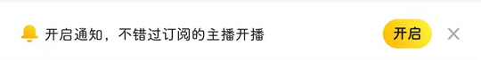
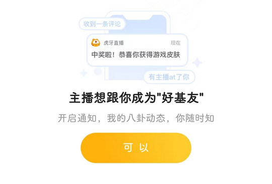

# com.duowan.kiwi（虎牙直播）

## 普通规则

快速复制:
```
{"popup_rules":
    [
        {"id":"huyaui_float_notify_count_close","action":"huyaui_float_notify_count_close"},
        {"id":"开启通知，不错过订阅的主播开播","action":"iv_right"},
        {"id":"push_popup_sec_txt","action":"GLOBAL_ACTION_BACK"}
    ]
}
```
详细说明：
- [{"id":"huyaui_float_notify_count_close","action":"huyaui_float_notify_count_close"}](#idhuyaui_float_notify_count_closeactionhuyaui_float_notify_count_close)
- [{"id":"开启通知，不错过订阅的主播开播","action":"iv_right"}](#id开启通知不错过订阅的主播开播actioniv_right)
- [{"id":"push_popup_sec_txt","action":"GLOBAL_ACTION_BACK"}](#idpush_popup_sec_txtactionglobal_action_back)

### {"id":"huyaui_float_notify_count_close","action":"huyaui_float_notify_count_close"}
去除首页底部悬浮广告

### {"id":"开启通知，不错过订阅的主播开播","action":"iv_right"}
去除 “订阅” 页面开启通知提示信息



### {"id":"push_popup_sec_txt","action":"GLOBAL_ACTION_BACK"}
去除 “订阅” 页面开启通知弹窗



## 增强规则
