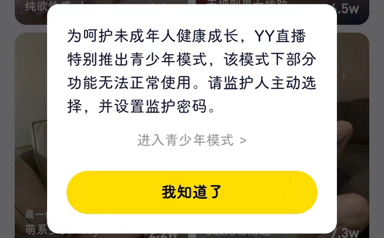
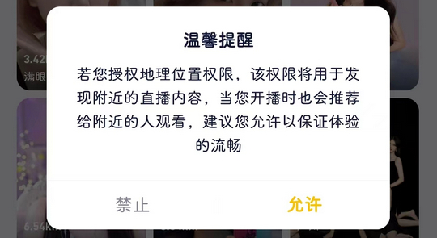

# com.duowan.mobile（YY）

## 普通规则

快速复制:
```
{"popup_rules":
    [
        {"id":"layout_young_tips","action":"ok_btn"},
        {"id":"授权地理位置权限","action":"btn_cancel"}
    ]
}
```
详细说明：
- [{"id":"懂车帝有更新啦","action":"以后再说"}](#id懂车帝有更新啦action以后再说)
- [{"id":"授权地理位置权限","action":"btn_cancel"}](#id授权地理位置权限actionbtn_cancel)

### {"id":"layout_young_tips","action":"ok_btn"}
去除青少年模式弹窗



### {"id":"授权地理位置权限","action":"btn_cancel"}
去除授权地理位置弹窗



## 增强规则
