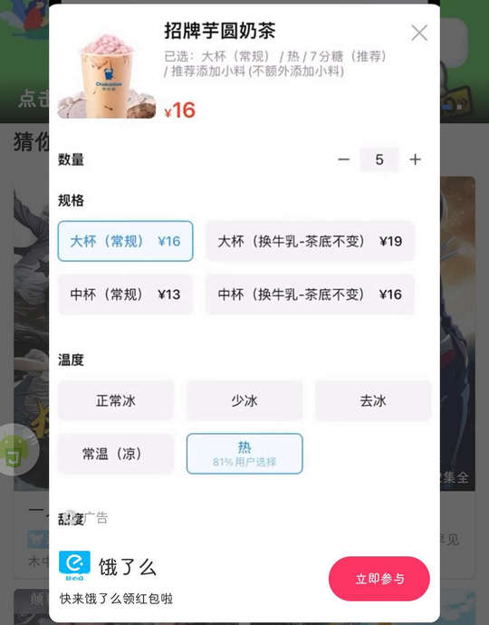

# com.feicui.vdhelper（翡翠视频）

## 基础规则

快速复制:
```
{"popup_rules":
    [
        {"id":"ksad_interstitial_native","action":"ksad_auto_close_btn"},
        {"id":"ad_area","action":"close_btn","delay_popup":5000},
        {"id":"img_native","action":"img_native_close"},
        {"id":"iv_apk_icon","action":"iv_close"},
        {"id":"广告","action":"跳过"},
        {"id":"tv_feedback_submit","action":"iv_feedback_close"}
    ]
}
```
详细说明：
- [{"id":"ksad_interstitial_native","action":"ksad_auto_close_btn"}](#idksad_interstitial_nativeactionksad_auto_close_btn)
- [{"id":"ad_area","action":"close_btn","delay_popup":5000}](#idad_areaactionclose_btndelay_popup5000)
- [{"id":"img_native","action":"img_native_close"}](#idimg_nativeactionimg_native_close)
- [{"id":"iv_apk_icon","action":"iv_close"}](#idiv_apk_iconactioniv_close)
- [{"id":"广告","action":"跳过"}](#id广告action跳过)
- [{"id":"tv_feedback_submit","action":"iv_feedback_close"}](#idtv_feedback_submitactioniv_feedback_close)

### {"id":"ksad_interstitial_native","action":"ksad_auto_close_btn"}
关闭广告弹窗-1



### {"id":"ad_area","action":"close_btn","delay_popup":5000}
关闭广告弹窗-2

⚡ 需要手动触发


### {"id":"img_native","action":"img_native_close"}
关闭视频详情页面广告


### {"id":"iv_apk_icon","action":"iv_close"}
关闭视频播放前广告结束弹窗


### {"id":"广告","action":"跳过"}
关闭广告弹窗-3


### {"id":"tv_feedback_submit","action":"iv_feedback_close"}
关闭反馈意见弹窗


## 增强规则
