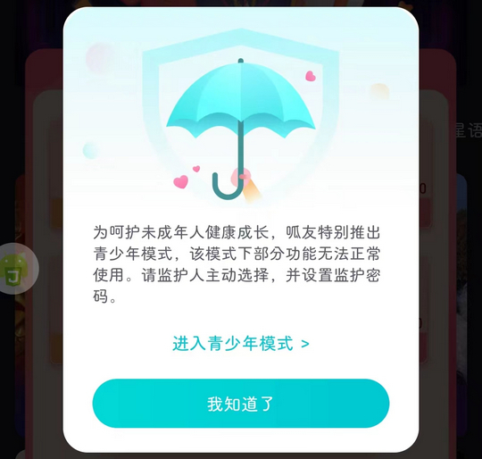

# com.GFriends.app（呱友）

## 基础规则

快速复制:
```
{"popup_rules":
    [
        {"id":"青少年模式","action":"我知道了"},
        {"id":"giftPackImg","action":"closeImg"},
        {"id":"sign_bg","action":"signClose"}
    ]
}
```
详细说明：
- [{"id":"青少年模式","action":"我知道了"}](#id青少年模式action我知道了)
- [{"id":"giftPackImg","action":"closeImg"}](#idgiftpackimgactioncloseimg)
- [{"id":"sign_bg","action":"signClose"}](#idsign_bgactionsignclose)

### {"id":"青少年模式","action":"我知道了"}
关闭青少年模式弹窗



### {"id":"giftPackImg","action":"closeImg"}
关闭首充弹窗


### {"id":"sign_bg","action":"signClose"}
关闭签到弹窗


## 增强规则
