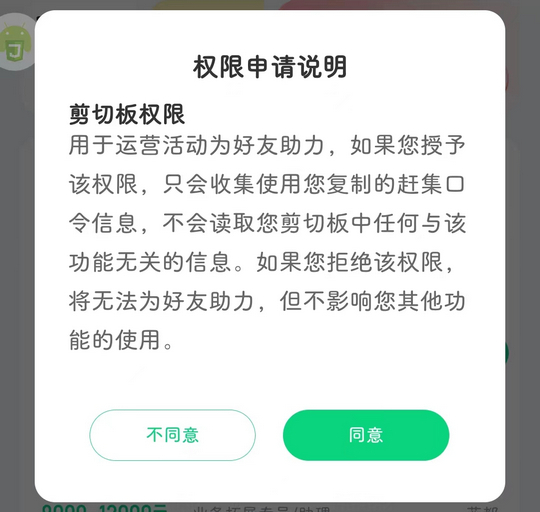
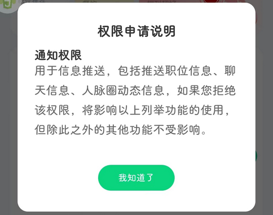
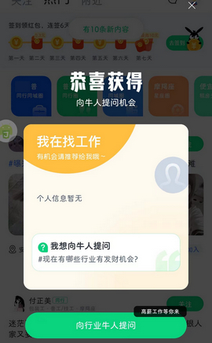
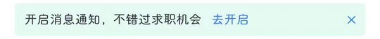
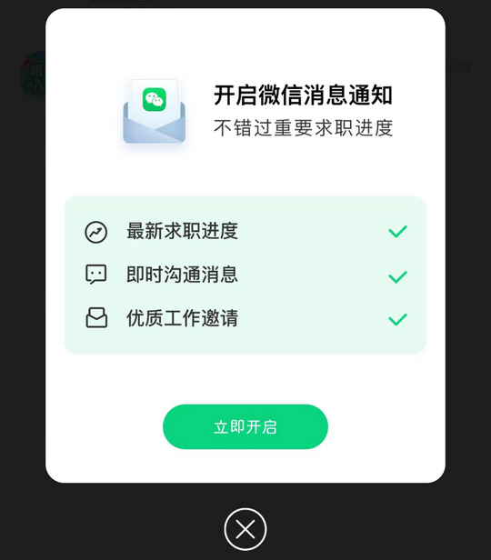
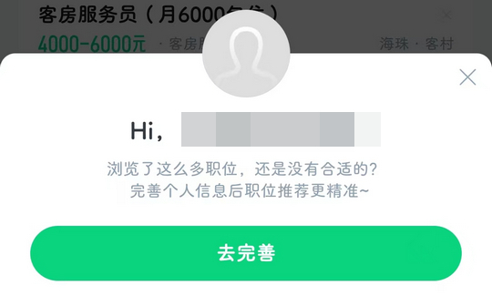

# com.ganji.android（赶集直招）

## 普通规则

快速复制:
```
{"popup_rules":
    [
        {"id":"权限申请说明","action":"不同意"},
        {"id":"权限申请说明","action":"我知道了"},
        {"id":"img_bg_header","action":"img_close"},
        {"id":"txt_client_top_location_guide_title","action":"client_top_location_guide_cancel"},
        {"id":"contact_post_guide_layout_contact","action":"contact_post_guide_img_close"},
        {"id":"开启消息通知","action":"✕"},
        {"id":"ll_wechat_bind_layout","action":"iv_wechat_bind_close"},
        {"id":"img_bg","action":"img_close"},
        {"id":"完善个人信息","action":"iv_dtl_dialog_close"}
    ]
}
```
详细说明：
- [{"id":"权限申请说明","action":"不同意"}](#id权限申请说明action不同意)
- [{"id":"权限申请说明","action":"我知道了"}](#id权限申请说明action我知道了)
- [{"id":"img_bg_header","action":"img_close"}](#idimg_bg_headeractionimg_close)
- [{"id":"txt_client_top_location_guide_title","action":"client_top_location_guide_cancel"}](#idtxt_client_top_location_guide_titleactionclient_top_location_guide_cancel)
- [{"id":"contact_post_guide_layout_contact","action":"contact_post_guide_img_close"}](#idcontact_post_guide_layout_contactactioncontact_post_guide_img_close)
- [{"id":"开启消息通知","action":"✕"}](#id开启消息通知action✕)
- [{"id":"ll_wechat_bind_layout","action":"iv_wechat_bind_close"}](#idll_wechat_bind_layoutactioniv_wechat_bind_close)
- [{"id":"img_bg","action":"img_close"}](#idimg_bg_headeractionimg_close)
- [{"id":"完善个人信息","action":"iv_dtl_dialog_close"}](#id完善个人信息actioniv_dtl_dialog_close)

### {"id":"权限申请说明","action":"不同意"}
去除剪贴板权限申请弹窗



### {"id":"权限申请说明","action":"我知道了"}
去除消息权限申请弹窗



### {"id":"img_bg_header","action":"img_close"}
去除首页弹窗广告


### {"id":"txt_client_top_location_guide_title","action":"client_top_location_guide_cancel"}
去除首页上方 “开启定位” 提示信息


### {"id":"contact_post_guide_layout_contact","action":"contact_post_guide_img_close"}
去除 “人脉圈” 页面 “向行业牛人提问” 弹窗



### {"id":"开启消息通知","action":"✕"}
去除 “消息” 页面上方 “开启消息通知” 提示信息



### {"id":"ll_wechat_bind_layout","action":"iv_wechat_bind_close"}
去除 “开启微信消息通知” 弹窗



### {"id":"img_bg","action":"img_close"}
去除 消息 -> 神奇面试间 页面广告弹窗


### {"id":"完善个人信息","action":"iv_dtl_dialog_close"}
去除 “完善人信息” 弹窗



## 增强规则
