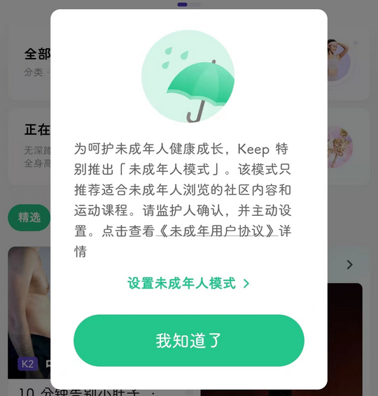
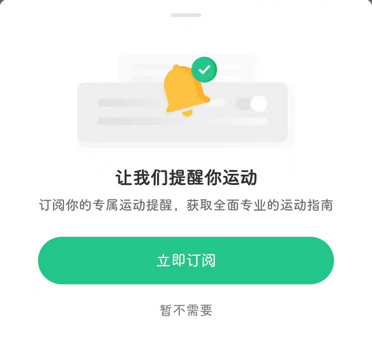

# com.gotokeep.keep（Keep）

## 普通规则

快速复制:
```
{"popup_rules":
    [
        {"id":"设置未成年人模式","action":"我知道了"},
        {"id":"imgCloseHomePageDialog","action":"imgCloseHomePageDialog"},
        {"id":"让我们提醒你运动","action":"暂不需要"}
    ]
}
```
详细说明：
- [{"id":"设置未成年人模式","action":"我知道了"}](#id设置未成年人模式action我知道了)
- [{"id":"imgCloseHomePageDialog","action":"imgCloseHomePageDialog"}](#idimgclosehomepagedialogactionimgclosehomepagedialog)
- [{"id":"让我们提醒你运动","action":"暂不需要"}](#id让我们提醒你运动action暂不需要)

### {"id":"设置未成年人模式","action":"我知道了"}
去除青少年模式弹窗



### {"id":"imgCloseHomePageDialog","action":"imgCloseHomePageDialog"}
去除首页悬浮广告


### {"id":"让我们提醒你运动","action":"暂不需要"}
去除订阅运动提醒弹窗



## 增强规则
