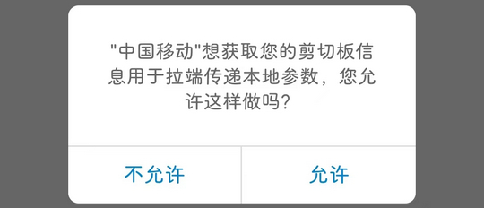
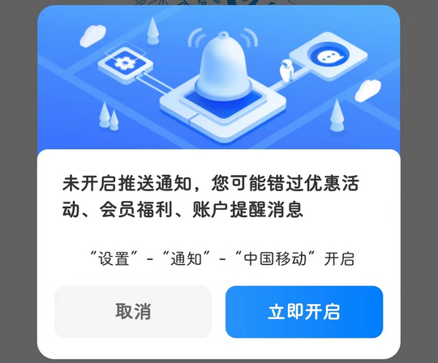

# com.greenpoint.android.mc10086.activity（中国移动）

## 普通规则

快速复制:
```
{"popup_rules":
    [
        {"id":"获取&剪切板","action":"不允许"},
        {"id":"开启推送通知","action":"取消"},
        {"id":"drag_img","action":"close_btn"},
        {"id":"图片跳转","action":"此图片未加标签"},
        {"id":"ad_image","action":"close_btn"}
    ]
}
```
详细说明：
- [{"id":"获取&剪切板","action":"不允许"}](#id获取剪切板action不允许)
- [{"id":"开启推送通知","action":"取消"}](#id开启推送通知action取消)
- [{"id":"drag_img","action":"close_btn"}](#iddrag_imgactionclose_btn)
- [{"id":"图片跳转","action":"此图片未加标签"}](#id图片跳转action此图片未加标签)
- [{"id":"ad_image","action":"close_btn"}](#idad_imageactionclose_btn)

### {"id":"获取&剪切板","action":"不允许"}
关闭获取剪贴板权限弹窗



### {"id":"开启推送通知","action":"取消"}
关闭开启推送通知弹窗



### {"id":"drag_img","action":"close_btn"}
关闭首页右下角悬浮广告


### {"id":"图片跳转","action":"此图片未加标签"}
关闭 “权益” 页面广告弹窗


### {"id":"ad_image","action":"close_btn"}
关闭广告弹窗


## 增强规则
