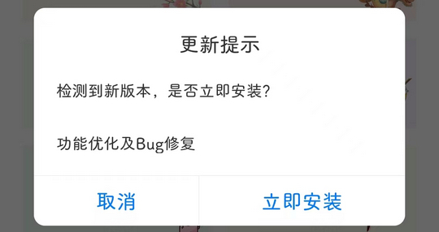

# com.guwendao.gwd（古文岛）

## 基础规则

快速复制:
```
{"popup_rules":
    [
        {"id":"更新提示","action":"取消"},
        {"id":"应用升级提醒","action":"取消"}
    ]
}
```
详细说明：
- [{"id":"更新提示","action":"取消"}](#id更新提示action取消)
- [{"id":"应用升级提醒","action":"取消"}](#id应用升级提醒action取消)

### {"id":"更新提示","action":"取消"}
关闭更新弹窗-1



### {"id":"应用升级提醒","action":"取消"}
关闭更新弹窗-2


## 增强规则
