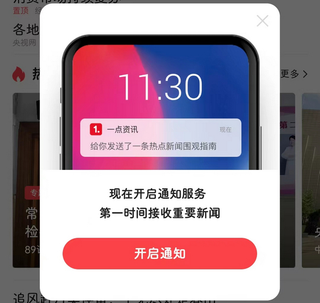

# com.hipu.yidian（一点资讯）

## 普通规则

快速复制:
```
{"popup_rules":
    [
        {"id":"开启通知服务","action":"GLOBAL_ACTION_BACK"},
        {"id":"明日来领&金币","action":"我知道了"}
    ]
}
```
详细说明：
- [{"id":"开启通知服务","action":"GLOBAL_ACTION_BACK"}](#id开启通知服务actionglobal_action_back)
- [{"id":"明日来领&金币","action":"我知道了"}](#id明日来领金币action我知道了)

### {"id":"开启通知服务","action":"GLOBAL_ACTION_BACK"}
关闭开启通知服务弹窗



### {"id":"明日来领&金币","action":"我知道了"}
关闭签到成功弹窗


## 增强规则
