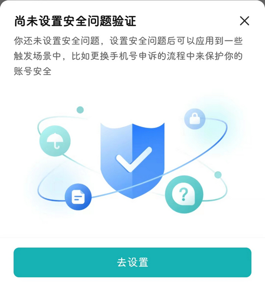

# com.hpbr.bosszhipin（BOSS直聘）

## 普通规则

快速复制:
```
{"popup_rules":
    [
        {"id":"尚未设置安全问题验证","action":"iv_close"}
    ]
}
```
详细说明：
- [{"id":"尚未设置安全问题验证","action":"iv_close"}](#id尚未设置安全问题验证actioniv_close)

### {"id":"尚未设置安全问题验证","action":"iv_close"}
去除 “设置安全问题” 弹窗



## 增强规则
