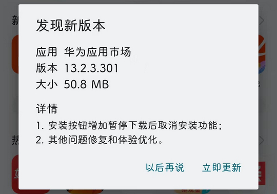
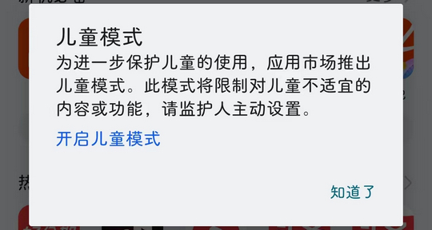
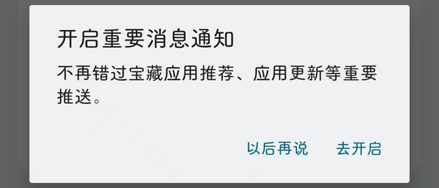

# com.huawei.appmarket（华为应用市场）

## 普通规则

快速复制:
```
{"popup_rules":
    [
        {"id":"发现新版本","action":"以后再说"},
        {"id":"儿童模式","action":"知道了"},
        {"id":"开启重要消息通知","action":"以后再说"}
    ]
}
```
详细说明：
- [{"id":"发现新版本","action":"以后再说"}](#id发现新版本action以后再说)
- [{"id":"儿童模式","action":"知道了"}](#id儿童模式action知道了)
- [{"id":"开启重要消息通知","action":"以后再说"}](#id开启重要消息通知action以后再说)

### {"id":"发现新版本","action":"以后再说"}
关闭更新弹窗



### {"id":"儿童模式","action":"知道了"}
关闭儿童模式弹窗



### {"id":"开启重要消息通知","action":"以后再说"}
关闭开启重要消息通知弹窗



## 增强规则
