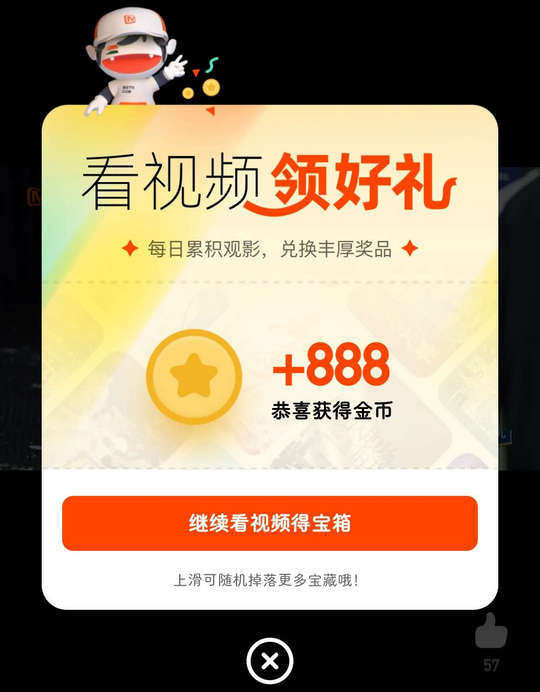
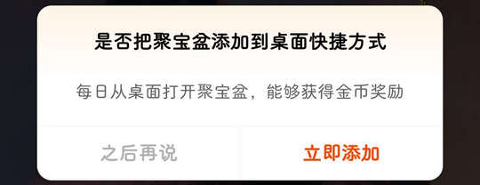

# com.hunantv.imgo.activity（芒果TV）

## 基础规则

快速复制:
```
{"popup_rules":
    [
        {"id":"打开消息推送通知","action":"ivCloseAlert"},
        {"id":"llJbpFirstPopContent","action":"ivJbpFirstPopClose"},
        {"id":"把聚宝盆添加到桌面快捷方式","action":"之后再说"},
        {"id":"apperience_enter","action":"apperience_close"},
        {"id":"rlRedPop","action":"ivClose"},
        {"id":"iv_pop_content","action":"iv_pop_close"},
        {"id":"ivPromotion","action":"btnClose"}
    ]
}
```
详细说明：
- [{"id":"打开消息推送通知","action":"ivCloseAlert"}](#id打开消息推送通知actionivclosealert)
- [{"id":"llJbpFirstPopContent","action":"ivJbpFirstPopClose"}](#idlljbpfirstpopcontentactionivjbpfirstpopclose)
- [{"id":"把聚宝盆添加到桌面快捷方式","action":"之后再说"}](#id把聚宝盆添加到桌面快捷方式action之后再说)
- [{"id":"apperience_enter","action":"apperience_close"}](#idapperience_enteractionapperience_close)
- [{"id":"rlRedPop","action":"ivClose"}](#idrlredpopactionivclose)
- [{"id":"iv_pop_content","action":"iv_pop_close"}](#idiv_pop_contentactioniv_pop_close)
- [{"id":"ivPromotion","action":"btnClose"}](#idivpromotionactionbtnclose)

### {"id":"打开消息推送通知","action":"ivCloseAlert"}
关闭打开消息推送通知弹窗


### {"id":"llJbpFirstPopContent","action":"ivJbpFirstPopClose"}
关闭看视频领好礼弹窗



### {"id":"把聚宝盆添加到桌面快捷方式","action":"之后再说"}
关闭把聚宝盆添加到桌面快捷方式弹窗



### {"id":"apperience_enter","action":"apperience_close"}
关闭首页右下角悬浮广告


### {"id":"rlRedPop","action":"ivClose"}
关闭“短剧”页面下方推荐视频提示信息


### {"id":"iv_pop_content","action":"iv_pop_close"}
关闭“会员”页面下方广告弹窗


### {"id":"ivPromotion","action":"btnClose"}
关闭“我的”页面广告弹窗


## 增强规则
