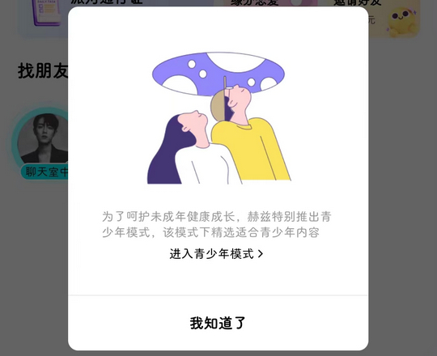
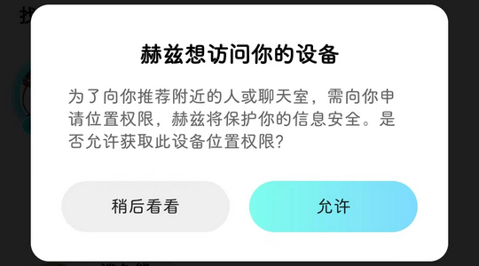
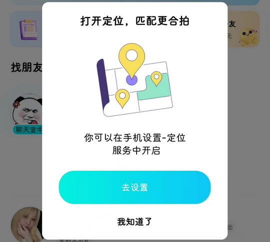
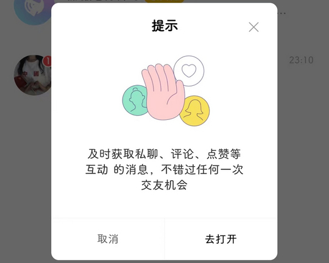

# com.immomo.vchat（赫兹）

## 普通规则

快速复制:
```
{"popup_rules":
    [
        {"id":"青少年模式","action":"我知道了"},
        {"id":"common_confirm_dialog_center_layout","action":"common_confirm_dialog_cancel"},
        {"id":"打开定位","action":"我知道了"},
        {"id":"及时获取&消息","action":"取消"},
        {"id":"tv_love_sub_title","action":"iv_close_love_tips"},
        {"id":"打开通知","action":"iv_notice_close"}
    ]
}
```
详细说明：
- [{"id":"青少年模式","action":"我知道了"}](#id青少年模式action我知道了)
- [{"id":"common_confirm_dialog_center_layout","action":"common_confirm_dialog_cancel"}](#idcommon_confirm_dialog_center_layoutactioncommon_confirm_dialog_cancel)
- [{"id":"打开定位","action":"我知道了"}](#id打开定位action我知道了)
- [{"id":"及时获取&消息","action":"取消"}](#id及时获取消息action取消)
- [{"id":"tv_love_sub_title","action":"iv_close_love_tips"}](#idtv_love_sub_titleactioniv_close_love_tips)
- [{"id":"打开通知","action":"iv_notice_close"}](#id打开通知actioniv_notice_close)

### {"id":"青少年模式","action":"我知道了"}
去除 “青少年模式” 弹窗



### {"id":"common_confirm_dialog_center_layout","action":"common_confirm_dialog_cancel"}
去除 “开启位置权限” 弹窗



### {"id":"打开定位","action":"我知道了"}
去除 “打开定位” 弹窗



### {"id":"及时获取&消息","action":"取消"}
去除 “及时获取消息” 弹窗



### {"id":"tv_love_sub_title","action":"iv_close_love_tips"}
去除 “消息” 页面右下角悬浮广告


### {"id":"打开通知","action":"iv_notice_close"}
去除 “消息” 页面上方 “打开通知” 提示信息


## 增强规则
