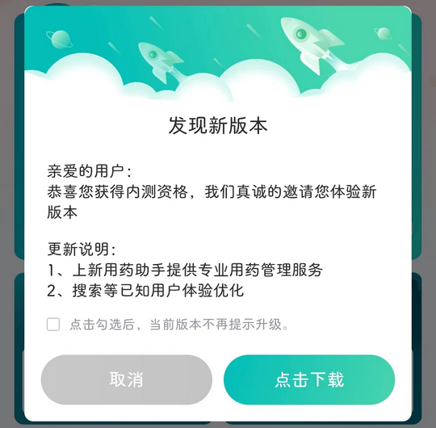
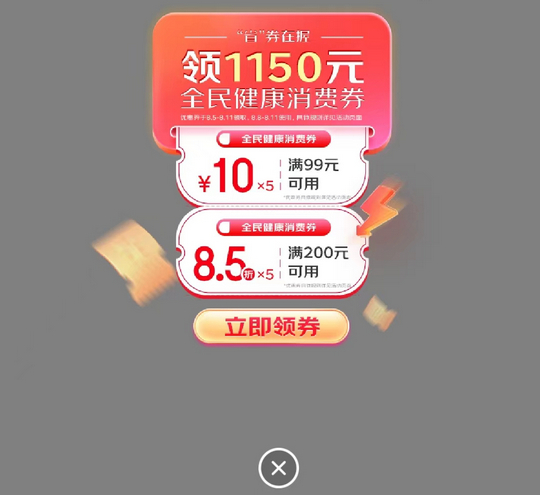
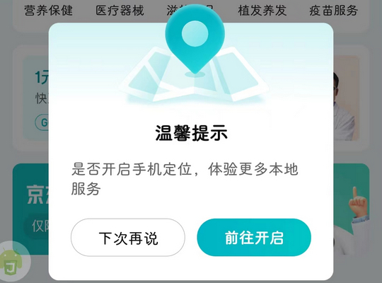

# com.jd.jdhealth（京东健康）

## 普通规则

快速复制:
```
{"popup_rules":
    [
        {"id":"upgrade_title","action":"upgrade_cancel"},
        {"id":"lciv_img","action":"lciv_close"},
        {"id":"开启手机定位","action":"下次再说"}
    ]
}
```
详细说明：
- [{"id":"upgrade_title","action":"upgrade_cancel"}](#idupgrade_titleactionupgrade_cancel)
- [{"id":"lciv_img","action":"lciv_close"}](#idlciv_imgactionlciv_close)
- [{"id":"开启手机定位","action":"下次再说"}](#id开启手机定位action下次再说)

### {"id":"upgrade_title","action":"upgrade_cancel"}
去除更新弹窗



### {"id":"lciv_img","action":"lciv_close"}
去除 “消息” 页面弹窗广告



### {"id":"开启手机定位","action":"下次再说"}
去除开启手机定位弹窗



## 增强规则
