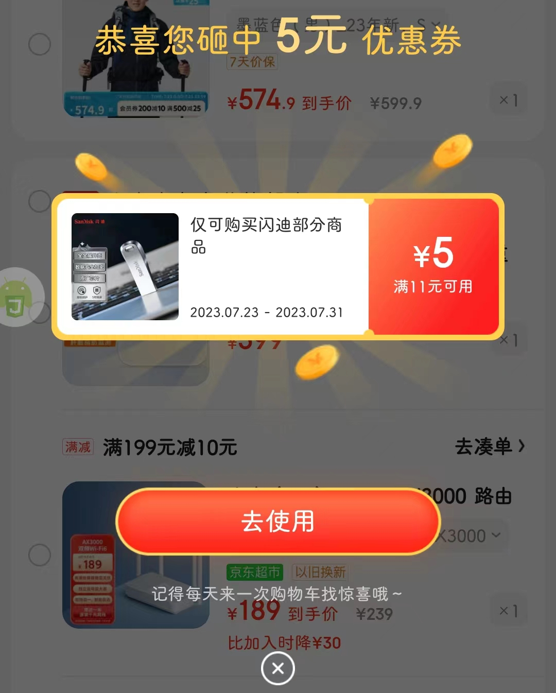
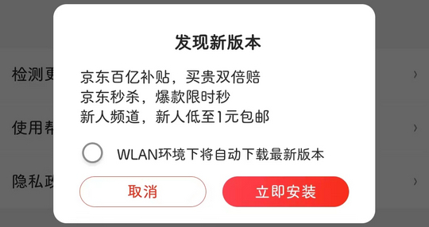

# com.jingdong.app.mall（京东）

## 普通规则

快速复制:
```
{"popup_rules":
    [
        {"id":"icon_cart_egg_close","action":"icon_cart_egg_close"},
        {"id":"弹窗","action":"关闭按钮"},
        {"id":"发现新版本","action":"取消"}
    ]
}
```
详细说明：
- [{"id":"icon_cart_egg_close","action":"icon_cart_egg_close"}](#idicon_cart_egg_closeactionicon_cart_egg_close)
- [{"id":"弹窗","action":"关闭按钮"}](#id弹窗action关闭按钮)
- [{"id":"发现新版本","action":"取消"}](#id发现新版本action取消)

### {"id":"icon_cart_egg_close","action":"icon_cart_egg_close"}
去除购物车砸金蛋优惠券弹窗。



### {"id":"弹窗","action":"关闭按钮"}
去除 PLUS 会员领取红包弹窗


### {"id":"发现新版本","action":"取消"}
去除版本更新弹窗



## 增强规则
