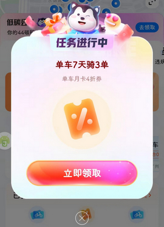
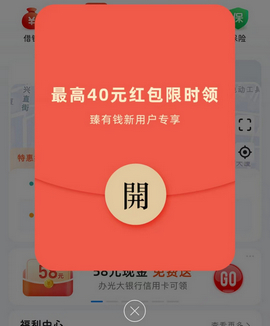
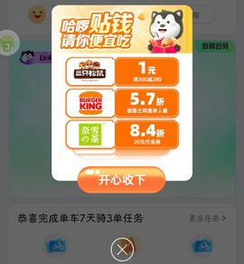
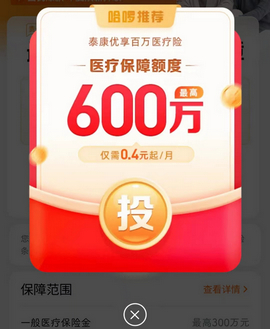

# com.jingyao.easybike（哈啰）

## 普通规则

快速复制:
```
{"popup_rules":
    [
        {"id":"单车&天骑&单&立即领取","action":"actionDialogClose"},
        {"id":"hbDialogLayout","action":"actionDialogClose"},
        {"id":"gENrrooPRRSKS2nmR644j","action":"gENrrooPRRSKS2nmR644j"},
        {"id":"resize,w_933","action":"OcAed8BaQIDrlsAAAAASUVORK5CYII="}
    ]
}
```
详细说明：
- [{"id":"单车&天骑&单&立即领取","action":"actionDialogClose"}](#id单车天骑单立即领取actionactiondialogclose)
- [{"id":"hbDialogLayout","action":"actionDialogClose"}](#idhbdialoglayoutactionactiondialogclose)
- [{"id":"d7ce40d514f542eeaf48edea0ab245db","action":"gENrrooPRRSKS2nmR644j"}](#idd7ce40d514f542eeaf48edea0ab245dbactiongenrrooprrsks2nmr644j)
- [{"id":"resize,w_933","action":"OcAed8BaQIDrlsAAAAASUVORK5CYII="}](#idresizew_933actionocaed8baqidrlsaaaaasuvork5cyii)

### {"id":"单车&天骑&单&立即领取","action":"actionDialogClose"}
去除 “骑行” 页面 “任务进行中” 弹窗



### {"id":"hbDialogLayout","action":"actionDialogClose"}
去除开屏红包弹窗



### {"id":"d7ce40d514f542eeaf48edea0ab245db","action":"gENrrooPRRSKS2nmR644j"}
去除骑行结束页面优惠券弹窗（⚠ 6.44.5 版本适用）



### {"id":"resize,w_933","action":"OcAed8BaQIDrlsAAAAASUVORK5CYII="}
去除哈啰推荐医疗保险弹窗（⚠ 6.44.5 版本适用）



## 增强规则
