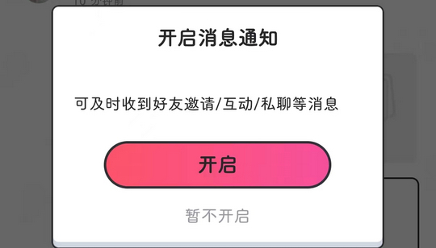

# com.kugou.android.douge（酷狗唱唱斗歌版）

## 基础规则

快速复制:
```
{"popup_rules":
    [
        {"id":"青少年模式","action":"知道了"},
        {"id":"开启消息通知","action":"暂不开启"},
        {"id":"不要错过重要消息，试试个性化管理吧","action":"bce"}
    ]
}
```
详细说明：
- [{"id":"青少年模式","action":"知道了"}](#id青少年模式action知道了)
- [{"id":"开启消息通知","action":"暂不开启"}](#id开启消息通知action暂不开启)
- [{"id":"不要错过重要消息，试试个性化管理吧","action":"bce"}](#id不要错过重要消息试试个性化管理吧actionbce)

### {"id":"青少年模式","action":"知道了"}
关闭青少年模式弹窗


### {"id":"开启消息通知","action":"暂不开启"}
关闭开启消息通知弹窗



### {"id":"不要错过重要消息，试试个性化管理吧","action":"bce"}
关闭“试试个性化管理”提示信息

⚠ 仅测试 1.8.9 版本，其他版本可用性未知

⚠ 不稳定，可能需要手动触发


## 增强规则
