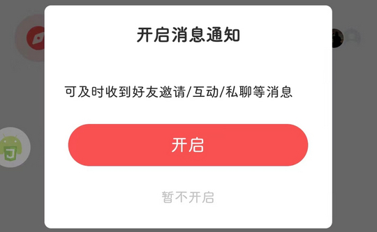

# com.kugou.android.ktvapp（酷狗唱唱）

## 普通规则

快速复制:
```
{"popup_rules":
    [
        {"id":"青少年模式","action":"知道了"},
        {"id":"bv7","action":"h1_"},
        {"id":"开启消息通知","action":"暂不开启"},
        {"id":"不&错过重要消息","action":"fmk"}
    ]
}
```
详细说明：
- [{"id":"青少年模式","action":"知道了"}](#id青少年模式action知道了)
- [{"id":"bv7","action":"h1_"}](#idbv7actionh1_)
- [{"id":"开启消息通知","action":"暂不开启"}](#id开启消息通知action暂不开启)
- [{"id":"不&错过重要消息","action":"fmk"}](#id不错过重要消息actionfmk)

### {"id":"青少年模式","action":"知道了"}
关闭青少年模式弹窗


### {"id":"bv7","action":"h1_"}
关闭 “歌房” 页面右下角悬浮广告 (⚠ 仅测试 4.4.0 版本，其他版本可用性未知)


### {"id":"开启消息通知","action":"暂不开启"}
关闭开启消息通知弹窗



### {"id":"不&错过重要消息","action":"fmk"}
关闭试试个性化管理提示信息


## 增强规则
