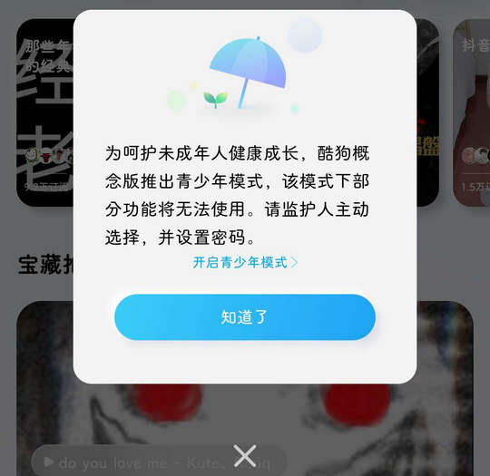

# com.kugou.android.lite（酷狗概念版）

该 App 界面控件 ID 经过混淆，对其适配极其有限。

## 基础规则

快速复制:
```
{"popup_rules":
    [
        {"id":"开启青少年模式","action":"知道了"}
    ]
}
```
详细说明：
- [{"id":"开启青少年模式","action":"知道了"}](#id开启青少年模式action知道了)

### {"id":"开启青少年模式","action":"知道了"}
关闭青少年模式弹窗



## 增强规则
